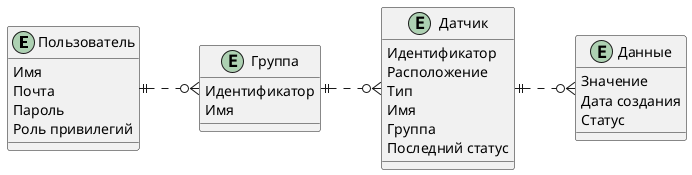

# Project_template

Это шаблон для решения проектной работы. Структура этого файла повторяет структуру заданий. Заполняйте его по мере работы над решением.

# Задание 1. Анализ и планирование

<aside>

Чтобы составить документ с описанием текущей архитектуры приложения, можно часть информации взять из описания компании и условия задания. Это нормально.

</aside

### 1. Описание функциональности монолитного приложения

**Управление отоплением:**

- Пользователи могут удаленно включать / выключать отопление в своих домах
- Система поддерживает добавление новых датчиков
- Датчики при включении регистрируются при помощи обращению к монолиту
- Обновление / Удаление датчика
- Обновление данных датчиков по инициативе датчика (PATCH /api/v1/sensors/:id/value)

**Мониторинг температуры:**

- Пользователи могут удаленно просматривать информацию о температуре
- Система поддерживает сбор информации с нескольких устройств
- Данны получаются синхронно через запрос к монолиту
- Можно получить список датчиков или информацию по отдельному
- Можно получить информацию не только ID датчику, но и по названию помещения

### 2. Анализ архитектуры монолитного приложения

Перечислите здесь основные особенности текущего приложения: какой язык программирования используется, какая база данных, как организовано взаимодействие между компонентами и так далее.

**Особенности текущего приложения**:
- Язык программирования: Go
- База данных: PostgreSQL
- Протоокол общения: HTTP
- Архитектура представляет собой 3 слоя:
  - HTTP обработчик
  - Сервис слой (В данном случае он используется для обращения к конкретному API по HTTP)
  - DB слой для общения с базой данных
- Настроен простой health-check
- Есть gracefull shutdown приложения при получени syscall.SIGINT, syscall.SIGTERM
- Конфигурация передается через переменные окружения (env)
- Все компоненты системы находятся в рамках одного приложения
- При перезапуске весь функционал будет недоступен

### 3. Определение доменов и границы контекстов

Опишите здесь домены, которые вы выделили.

1. Управление устройствами
2. Мониторинг состояний устройств
3. Управление пользователями

### **4. Проблемы монолитного решения**

- Сложность масштабируемости отдельных компонентов
- При обновлении одного компонента, будут также недоступны другие
- Сложности при совместной разработке и деплое

Если вы считаете, что текущее решение не вызывает проблем, аргументируйте свою позицию.

### 5. Визуализация контекста системы — диаграмма С4

Добавьте сюда диаграмму контекста в модели C4.

```plantuml
@startuml

title Тёплый дом Context Diagram

top to bottom direction

!includeurl https://raw.githubusercontent.com/RicardoNiepel/C4-PlantUML/master/C4_Component.puml

Person(user, "Пользователь", "Меняет и просматривает температуру")
Person(admin, "Администратор", "Управляет датчиками пользователя")
System(WarmHouseSystem, "Монолит", "Система по управлению, сбору и обработки данных датчиков")

System_Ext(sensor1, "Датчик 1", "API на устройстве регулировки")
System_Ext(sensorN, "Датчик N", "API на устройстве регулировки")

Rel(user, WarmHouseSystem, "Использует систему")
Rel(admin, WarmHouseSystem, "Администрирует систему")
Rel(WarmHouseSystem, sensor1, "Управление датчиками")
Rel(WarmHouseSystem, sensorN, "Управление датчиками")
Rel(sensor1, WarmHouseSystem, "Регистрация / Обновление данных")
Rel(sensorN, WarmHouseSystem, "Регистрация / Обновление данных")

@enduml
```

# Задание 2. Проектирование микросервисной архитектуры

В этом задании вам нужно предоставить только диаграммы в модели C4. Мы не просим вас отдельно описывать получившиеся микросервисы и то, как вы определили взаимодействия между компонентами To-Be системы. Если вы правильно подготовите диаграммы C4, они и так это покажут.

**Диаграмма контейнеров (Containers)**

```plantuml
@startuml

title Тёплый дом Container Diagram

top to bottom direction

!includeurl https://raw.githubusercontent.com/RicardoNiepel/C4-PlantUML/master/C4_Container.puml

Person(user, "Пользователь", "Меняет и просматривает температуру")
Person(admin, "Администратор", "Управляет устройствами пользователя")

Container_Boundary(WarmHouseSystem, "Тёплый дом") {
	Container(WebApp, "Веб приложение", "React", "SPA приложение для управления отоплением")
	Container(NginxProxy, "Edge Gateway", "Nginx", "SSL termination, статика, API gateway")
	Container(IngressEnvoy, "Ingress Envoy", "Envoy Proxy", "Точка входа в service mesh")
	
	Container_Boundary(ServiceMesh, "Service Mesh (Envoy Sidecar Pattern)") {
		Container(SensorsAPI, "API Управление устройствами", "Go + Envoy sidecar", "Регистрация устройств, управление конфигурацией")
		Container(StateMonitoringAPI, "API Мониторинг состояний", "Go + Envoy sidecar", "Прием показаний от устройств, аналитика, алерты")
		Container(UsersAPI, "API Users", "Go + Envoy sidecar", "Работа с пользователями")
	}
	
	Container(PgBouncer, "Connection Pool", "PgBouncer", "Пул соединений к БД")
	ContainerDb(Database, "База данных", "PostgreSQL", "Устройства, показания, конфигурация")
	Container(S3, "Хранилище файлов", "MinIO", "Логи, снапшоты, статистика")
	Container(MessageBroker, "Message Broker", "Apache Kafka", "Асинхронная обработка событий от устройств")
}

System_Ext(sensorDevice, "Устройство", "Физическое устройство с API")

' Пользователи
Rel(user, WebApp, "Использует", "HTTPS")
Rel(admin, WebApp, "Администрирует", "HTTPS")

' Nginx
Rel(WebApp, NginxProxy, "API запросы", "HTTPS")
Rel(NginxProxy, IngressEnvoy, "Проксирует к сервисам", "HTTP")
Rel_L(NginxProxy, S3, "Отдает статику", "HTTP")

' Envoy
Rel(IngressEnvoy, SensorsAPI, "Запросы от админа/пользователя", "HTTP")
Rel(IngressEnvoy, UsersAPI, "Запросы от админа/пользователя", "HTTP")
Rel(IngressEnvoy, StateMonitoringAPI, "Запросы от устройств и пользователей", "HTTP")

' S2S через sidecar Envoy
Rel(SensorsAPI, StateMonitoringAPI, "Получает актуальные показания", "HTTP")
Rel(StateMonitoringAPI, SensorsAPI, "Проверяет существование устройства", "HTTP")
Rel(SensorsAPI, UsersAPI, "Проверка авторизации пользователя и действия", "HTTP")
Rel(StateMonitoringAPI, UsersAPI, "Проверяет разрешенность запроса для пользователя", "HTTP")

' Брокер
Rel(StateMonitoringAPI, MessageBroker, "Публикует показания", "AMQP")
Rel(StateMonitoringAPI, MessageBroker, "Считывает показания", "AMQP")

' Database
Rel(SensorsAPI, PgBouncer, "CRUD устройств, конфигурация")
Rel(StateMonitoringAPI, PgBouncer, "Запись показаний, чтение для аналитики")
Rel(PgBouncer, Database, "Пул соединений")

' Обновление данных устройств
Rel(sensorDevice, IngressEnvoy, "POST /sensors/:id/value", "HTTPS")

@enduml
```

**Диаграмма компонентов (Components)**

```plantuml
@startuml

title Тёплый дом API Управление устройствами Container Diagram

top to bottom direction

!includeurl https://raw.githubusercontent.com/RicardoNiepel/C4-PlantUML/master/C4_Component.puml


Container_Boundary(WarmHouseSystem, "Тёплый дом") {
	Container_Boundary(ServiceMesh, "Envoy Sidecar Pattern") {
		Container(SensorsAPI, "API Управление устройствами", "Go + Envoy sidecar", "Регистрация устройств, управление конфигурацией") {
			Component(AuthMiddleware, "AuthMiddleware", "Управляет авторизацией и аутентификацией клиентов")
			Component(DeviceController, "DeviceController", "Delivery слой обработки")
			Component(Service, "Service", "Бизнес логика")
			Component(DatabaseRepository, "Database Repository", "Доступ к данным об устройствах")
			Component(MonitoringRepository, "Monitoring Repository", "Доступ к данным устройств")
			Component(AuthRepository, "Auth Repository", "Доступ к данным пользователей")
		}
		Container(EnvoySidecar, "Envoy Sidecar", "Envoy", "Проксирование запросов")
	}
	
	Container(PgBouncer, "Connection Pool", "PgBouncer", "Пул соединений к БД")
	Container(StateMonitoringAPI, "API Мониторинг состояний", "Go + Envoy sidecar", "Прием показаний от устройств, аналитика, алерты")
	Container(UsersAPI, "API Users", "Go + Envoy sidecar", "Работа с пользователями")
}


' Обращения внутри сервиса
Rel_R(AuthMiddleware, DeviceController, "Передает запрос дальше")
Rel(DeviceController, Service, "Вызывает бизнес логику")
Rel(Service, DatabaseRepository, "Читает/Пишет данные")
Rel(Service, MonitoringRepository, "Получает информацию")
Rel(AuthMiddleware, Service, "Вызывает бизнес логику")
Rel(Service, AuthRepository, "Аутентификация пользователя и авторизация запроса")

' Database
Rel(DatabaseRepository, EnvoySidecar, "CRUD устройств, конфигурация")
Rel(EnvoySidecar, PgBouncer, "CRUD устройств, конфигурация")

' API
Rel(MonitoringRepository, EnvoySidecar, "Информация об устройствах", "HTTP")
Rel(EnvoySidecar, StateMonitoringAPI, "Информация об устройствах", "HTTP")
Rel(AuthRepository, EnvoySidecar, "Аутентификация пользователя и авторизация запроса", "HTTP")
Rel(EnvoySidecar, UsersAPI, "Аутентификация пользователя и авторизация запроса", "HTTP")

@enduml
```


```plantuml
@startuml

title Тёплый дом API Мониторинг состояний Container Diagram

top to bottom direction

!includeurl https://raw.githubusercontent.com/RicardoNiepel/C4-PlantUML/master/C4_Component.puml


Container_Boundary(WarmHouseSystem, "Тёплый дом") {
	Container_Boundary(ServiceMesh, "Envoy Sidecar Pattern") {
		Container(StateMonitoringAPI, "API Мониторинг состояний", "Go", "Прием показаний от устройств, аналитика, алерты") {
			Component(AuthMiddleware, "AuthMiddleware", "Управляет авторизацией и аутентификацией устройств и клиентов")
			Component(MonitoringController, "MonitoringController", "Delivery слой обработки")
			Component(CallbackController, "CallbackController", "Callback слой обработки")
			Component(Service, "Service", "Бизнес логика")
			Component(DatabaseRepository, "Database Repository", "Доступ к данным об устройствах")
			Component(QueueRepository, "Queue Repository", "Публикация/Чтение данных устройств")
			Component(MonitoringRepository, "Monitoring Repository", "Доступ к данным устройств")
			Component(AuthRepository, "Auth Repository", "Доступ к данным пользователей")
		}

		Container(EnvoySidecar, "Envoy Sidecar", "Envoy", "Проксирование запросов")
	}
	
	Container(PgBouncer, "Connection Pool", "PgBouncer", "Пул соединений к БД")
	Container(MessageBroker, "Message Broker", "Apache Kafka", "Асинхронная обработка событий от устройств")
	Container(SensorsAPI, "API Управление устройствами", "Go + Envoy sidecar", "Регистрация устройств, управление конфигурацией")
	Container(UsersAPI, "API Users", "Go + Envoy sidecar", "Работа с пользователями")
}


' Обращения внутри сервиса
Rel(MonitoringController, Service, "Вызывает бизнес логику")
Rel(CallbackController, Service, "Вызывает бизнес логику")
Rel(AuthMiddleware, MonitoringController, "Передает запрос дальше")
Rel(AuthMiddleware, CallbackController, "Передает запрос дальше")
Rel_R(AuthMiddleware, Service, "Вызывает бизнес логику")
Rel(Service, DatabaseRepository, "Читает/Пишет данные")
Rel(Service, MonitoringRepository, "Получает информацию")
Rel(Service, QueueRepository, "Пишет / Инициирует чтение")
Rel(Service, AuthRepository, "Аутентификация пользователя и авторизация запроса")

' Database
Rel(DatabaseRepository, EnvoySidecar, "Запись показаний, чтение для аналитики")
Rel(EnvoySidecar, PgBouncer, "Запись показаний, чтение для аналитики")

' API
Rel(MonitoringRepository, EnvoySidecar, "Проверяет регистрацию устройства", "HTTP")
Rel(EnvoySidecar, SensorsAPI, "Проверяет регистрацию устройства", "HTTP")
Rel(AuthRepository, EnvoySidecar, "Аутентификация пользователя и авторизация запроса", "HTTP")
Rel(EnvoySidecar, UsersAPI, "Аутентификация пользователя и авторизация запроса", "HTTP")


' Брокер
Rel(QueueRepository, EnvoySidecar, "Публикует показания", "AMQP")
Rel(QueueRepository, EnvoySidecar, "Считывает показания", "AMQP")
Rel(EnvoySidecar, MessageBroker, "Публикует показания", "AMQP")
Rel(EnvoySidecar, MessageBroker, "Считывает показания", "AMQP")

@enduml
```

**Диаграмма кода (Code)**

```plantuml
@startuml
title FitLife Membership Management Code Diagram

top to bottom direction

!includeurl https://raw.githubusercontent.com/RicardoNiepel/C4-PlantUML/master/C4_Component.puml

class MonitoringData {
  +Float value
  +String status
  +Date createdAt
  +void gather()
}

class Sensor {
  +Int id
  +String name
  +String type
  +String location
  +String unit
  +Date lastUpdated
  +Date createdAt
  +String lastStatus
  +void register()
  +void update()
  +void do()
}


class User {
  +String name
  +String email
  +Date password
  +String role
  +void register()
  +void login()
  +void delete()
}

User "1" -- "0..*" Sensor : has
Sensor "1" -- "0..*" MonitoringData : includes

@enduml
```

# Задание 3. Разработка ER-диаграммы

Добавьте сюда ER-диаграмму. Она должна отражать ключевые сущности системы, их атрибуты и тип связей между ними.



# Задание 4. Создание и документирование API

### 1. Тип API

Укажите, какой тип API вы будете использовать для взаимодействия микросервисов. Объясните своё решение.

```
Я буду использовать в основном REST API в частях где идет общение с клиентом (а именно SensorsAPI).
AsyncAPI буду использовать при взаимодейстии `датчик -> система (callback)`
```

### 2. Документация API

Здесь приложите ссылки на документацию API для микросервисов, которые вы спроектировали в первой части проектной работы. Для документирования используйте Swagger/OpenAPI или AsyncAPI.

[SensorsAPI](docs/swagger/SensorsAPI.yaml)
[StateMonitoringAPI](docs/swagger/StateMonitoringAPI.yaml)
[UsersAPI](docs/swagger/UsersAPI.yaml)
[SensorAPI](docs/swagger/SensorAPI.yaml)
[CommonComponents](docs/swagger/CommonComponents.yaml)

# Задание 5. Работа с docker и docker-compose

Перейдите в apps.

Там находится приложение-монолит для работы с датчиками температуры. В README.md описано как запустить решение.

Вам нужно:

1) сделать простое приложение temperature-api на любом удобном для вас языке программирования, которое при запросе /temperature?location= будет отдавать рандомное значение температуры.

Locations - название комнаты, sensorId - идентификатор названия комнаты

```
	// If no location is provided, use a default based on sensor ID
	if location == "" {
		switch sensorID {
		case "1":
			location = "Living Room"
		case "2":
			location = "Bedroom"
		case "3":
			location = "Kitchen"
		default:
			location = "Unknown"
		}
	}

	// If no sensor ID is provided, generate one based on location
	if sensorID == "" {
		switch location {
		case "Living Room":
			sensorID = "1"
		case "Bedroom":
			sensorID = "2"
		case "Kitchen":
			sensorID = "3"
		default:
			sensorID = "0"
		}
	}
```

2) Приложение следует упаковать в Docker и добавить в docker-compose. Порт по умолчанию должен быть 8081

3) Кроме того для smart_home приложения требуется база данных - добавьте в docker-compose файл настройки для запуска postgres с указанием скрипта инициализации ./smart_home/init.sql

Для проверки можно использовать Postman коллекцию smarthome-api.postman_collection.json и вызвать:

- Create Sensor
- Get All Sensors

Должно при каждом вызове отображаться разное значение температуры

Ревьюер будет проверять точно так же.


# **Задание 6. Разработка MVP**

Необходимо создать новые микросервисы и обеспечить их интеграции с существующим монолитом для плавного перехода к микросервисной архитектуре. 

### **Что нужно сделать**

1. Создайте новые микросервисы для управления телеметрией и устройствами (с простейшей логикой), которые будут интегрированы с существующим монолитным приложением. Каждый микросервис на своем ООП языке.
2. Обеспечьте взаимодействие между микросервисами и монолитом (при желании с помощью брокера сообщений), чтобы постепенно перенести функциональность из монолита в микросервисы. 

В результате у вас должны быть созданы Dockerfiles и docker-compose для запуска микросервисов. 